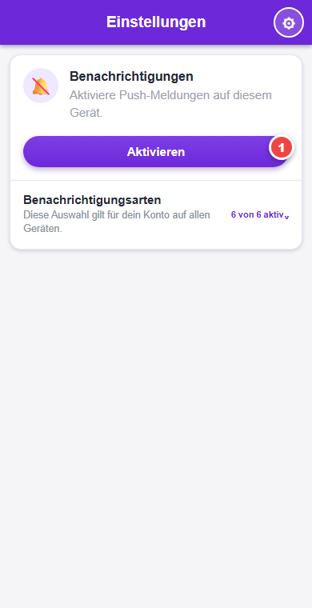
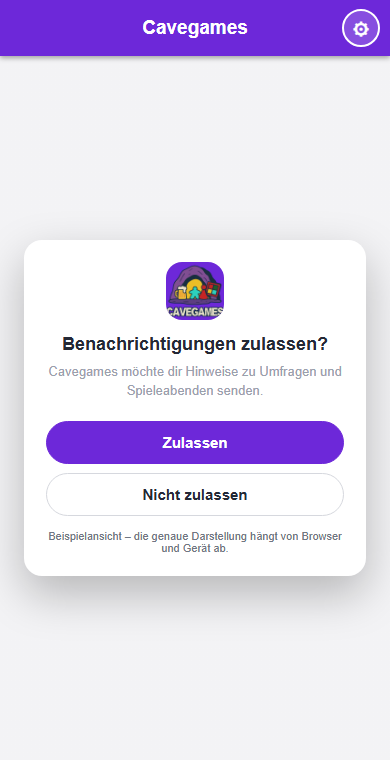
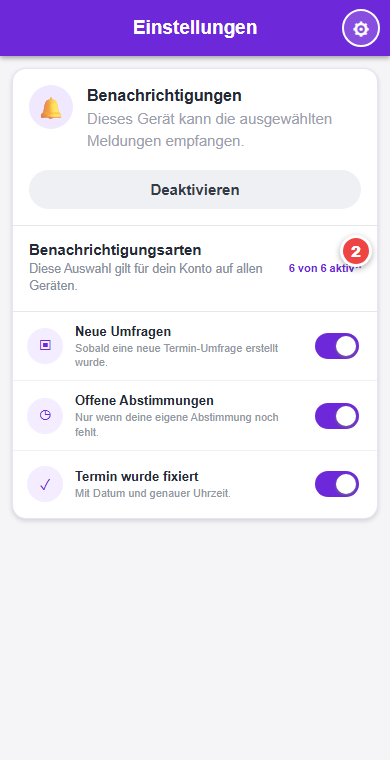

# Push-Benachrichtigungen aktivieren

Push-Benachrichtigungen werden **pro Gerät und Browser** aktiviert. Welche Meldungen du erhalten möchtest, wird dagegen in deinem Cavegames-Konto gespeichert und gilt auf allen Geräten.

## 1. Benachrichtigungen auf dem Gerät aktivieren

1. Öffne Cavegames und tippe oben rechts auf das Zahnrad.
2. Wähle **Einstellungen**.
3. Tippe im Bereich **Benachrichtigungen** auf **Aktivieren**.

## 2. Freigabe des Geräts bestätigen

Bestätige die anschliessende Abfrage des Browsers beziehungsweise Betriebssystems mit **Zulassen**.

> Die genaue Darstellung der Abfrage unterscheidet sich je nach Gerät und Browser. Wird **Nicht zulassen** gewählt, muss die Berechtigung später in den Browser- oder Geräteeinstellungen freigegeben werden.

## 3. Gewünschte Meldungen auswählen

Öffne **Benachrichtigungsarten** und schalte die gewünschten Kategorien ein oder aus. Die Auswahl gilt für dein Konto auf allen Geräten.

## Hinweis für iPhone und iPad

Auf Apple-Geräten muss Cavegames zuerst als Web-App installiert werden:

1. Cavegames in Safari öffnen.
2. Auf **Teilen** tippen.
3. **Zum Home-Bildschirm** auswählen.
4. Cavegames anschliessend über das neue Symbol auf dem Home-Bildschirm öffnen.
5. Die oben beschriebenen Schritte in der installierten App ausführen.

## Wenn keine Meldungen ankommen

- Prüfe, ob im Cavegames-Bereich **Benachrichtigungen** der Button **Deaktivieren** angezeigt wird. Dann ist dieses Gerät registriert.
- Prüfe, ob die gewünschte **Benachrichtigungsart** eingeschaltet ist.
- Kontrolliere in den Einstellungen des Browsers oder Betriebssystems, ob Cavegames Benachrichtigungen senden darf.
- Aktiviere Push-Benachrichtigungen auf jedem zusätzlichen Gerät separat.
